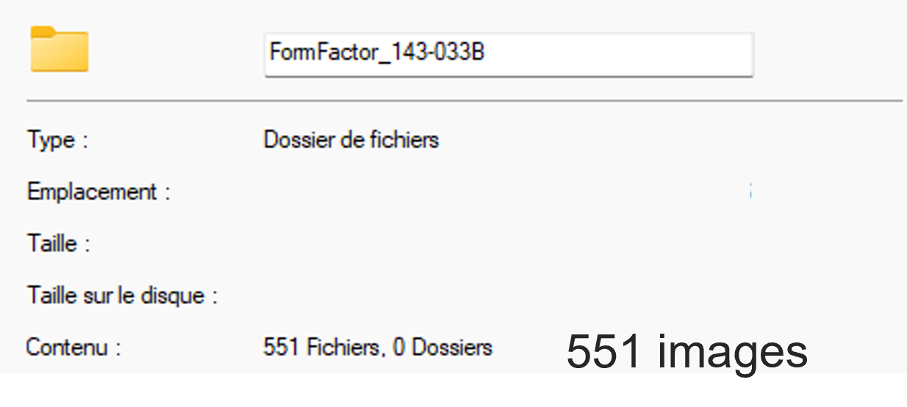
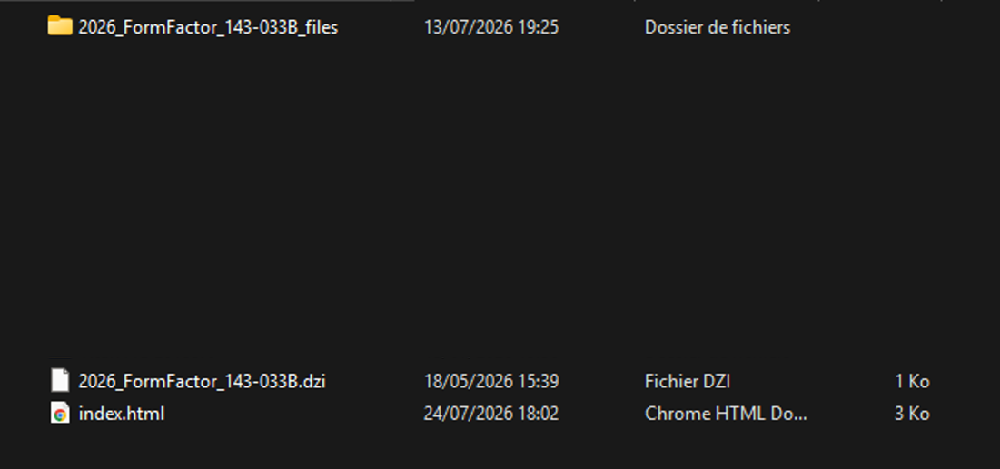
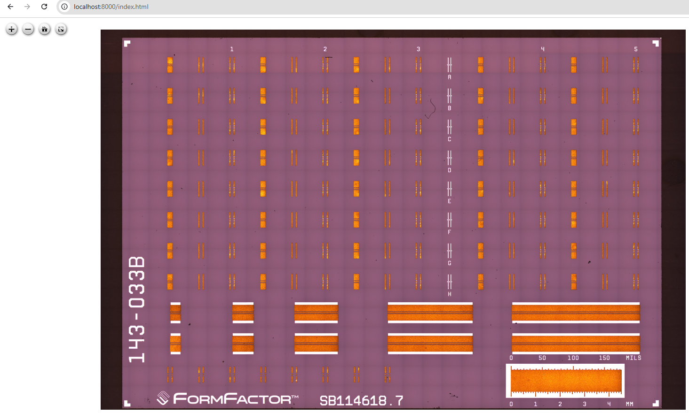
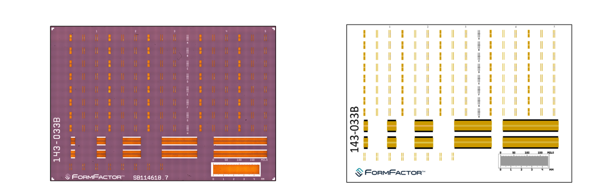
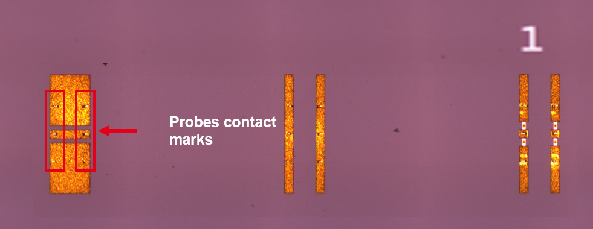

# DUT's Pyramidal Image Mosaic

---

<h4 align="center">
  <span> | </span>
  <a href="#mpi-wafer-probe-station-image-scanner"> MPI Wafer Probe Station Image Scanner</a>
  <span> | </span>
  <a href="#stitching---pyramidal-image">Stitching Pyramidal Image</a>
  <span> | </span>
  <a href="#visualize-the-pyramidal-image">Visualise the Pyramidal Image</a>
  <span> | </span>
  <a href="#example">Example</a>
  <span> | </span>
</h4>

---


## MPI Wafer Probe Station Image Scanner

Python script for automatically moving an MPI probe-station chuck and capturing microscope images over a **rectangular area** or a **circular wafer area** through **GPIB / VISA**.

The script is intended for automated wafer/die(s)/calkit inspection, DUT mosaic creation, and long microscope acquisition sequences.

### Features

- GPIB communication through `PyVISA`
- Automatic chuck X/Y positioning
- Microscope snapshot capture
- Rectangular raster scanning
- Circular wafer scanning
- Configurable X/Y step sizes
- Optional edge margin around the circular scan area
- Snapshot filenames containing:
  - image index
  - actual chuck X coordinate
  - actual chuck Y coordinate
  - autofocus Z value
- Resume support after an interrupted circular scan
- Configurable snapshot delay and mechanical settling time
- Automatic return to the initial chuck position
- Graceful interruption with `Ctrl+C`
- Optional debug output
  
---

## Stitching - Pyramidal Image

(On going : cleaning and merging codes)

---

## Visualize the Pyramidal Image

To visualize the pyramidal image with OpenSeadragon, open a terminal in the directory containing:
* `index.html`
* The `.dzi` files

Start a local HTTP server using Python:

```bash
python -m http.server 8000
```

Then open the following address in your browser:

```text
http://localhost:8000/
```

The `index.html` file should open automatically. You can also access it directly at:

```text
http://localhost:8000/index.html
```

To stop the server, return to the terminal and press:

```text
Ctrl+C
```

Make sure that the `.dzi` files and their corresponding tile folders remain in the paths referenced by `index.html`.

---

## Example

Example using a calkit

Once your DUT (**CALKIT**, **DIE**, or **WAFER**) is placed in the probe station, configure `MPI_take_images.py` according to your setup and run the script.

After the acquisition is complete, all captured images will be available in the configured output directory.

<div align="center">
  
    <br>
  <em>Example showing the number of images captured by MPI.</em>
</div>


Once all images have been acquired, run `stitching_images.py` to reconstruct the complete image from the individual tiles.

The script will generate:

- A folder containing the pyramidal image tiles, usually named `*_files`
- A `.dzi` descriptor file
- An `index.html` file used to display the image with OpenSeadragon

<div align="center">
  
  <br>
  <em>Files generated after the stitching process.</em>
</div>


Open a terminal in the directory containing the `.dzi` file, the `*_files` folder, and `index.html`, then start a local Python server:

```bash
python -m http.server 8000
```

Open the following address in your browser:
```bash
http://localhost:8000/index.html
```
The reconstructed pyramidal image can now be explored using the OpenSeadragon viewer.
<div align="center">
  
  <br>
  <em>Reconstructed image displayed in the OpenSeadragon viewer.</em>
</div>


<div align="center">
  
  <br>
  <em>Comparison between the acquired calibration kit image and its datasheet representation.</em>
</div>


This visualization is particularly useful for performing sanity checks and inspecting the different structures present on the DUT, whether it is a calibration kit, die, or wafer.

By zooming in sufficiently, it is also possible to inspect fine details such as the contact marks left by the probes on the pads.

<div align="center">
  
  <br>
  <em>Example of probe contact marks visible when zooming in on the pyramidal image.</em>
</div>


